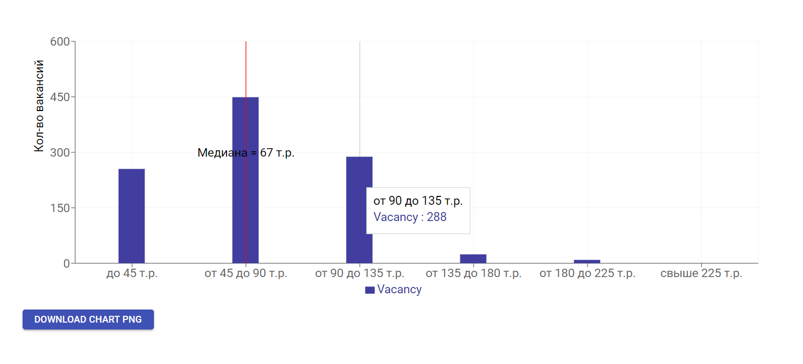

# HHadvisor

### Сервис анализа рынка труда на основе портала hh.ru

Используя параметры запуска начинает скачивание информации
по текущим вакансиям на рынке по введенным ключевым словам и регионам.
По собранным вакансиям приложение строит распределение зарплат в разрезе выбранного региона,
показывает среднее медианное значение по зарплате. Все собранные вакансии сохраняются в базу данных. При каждом новом запросе данные обнуляются.

Пример GET запроса: 

http://localhost:8080/search?name=Java&area=1

* параметр "name=" - Ключевое слово(можно указать несколько ключевых слов через запятую) для поиска по вакансиям.

* параметр "area="  - Указание города или региона для поиска.

Запрос http://localhost:8080/take отдает все собранные вакансии

Приложению требуется подключение к базе данных.

Применяемые технологии:
* Spring Boot
* Spring MVC
* Spring Data JPA
* REST

Примерный вывод данных на фронт :

